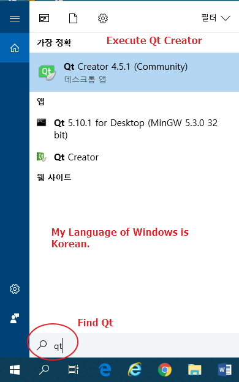
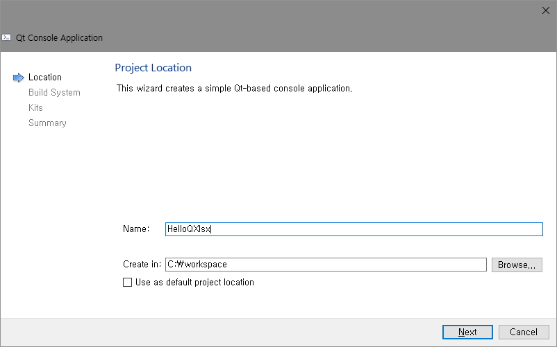
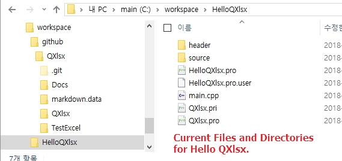

## QXlsx 프로젝트 설정하는 방법

> *Read this in other languages: [English](HowToSetProject.md), :kr: [한국어](HowToSetProject.ko.md)*

- QXlsx를 적용하는 쉬운 방법은 다음과 같습니다.
- Windows에 적용하는 방법을 설명합니다.
- Linux 또는 Mac에 적용하는 방법도 비슷하므로 추가 요청이 있으면 도움을 요청할 것입니다.

## 설정 단계

:one: github에서 소스 코드를 clone 합니다

```sh
git clone https://github.com/j2doll/QXlsx.git
```


<br /><br />

:two: QtCreator를 실행합니다



* QtCreator의 사용방법을 모르시면, Qt Company 싸이트를 참조하세요. [https://www.qt.io/qt-features-libraries-apis-tools-and-ide/](https://www.qt.io/qt-features-libraries-apis-tools-and-ide/)

<br /><br />

:three: 여러분의 Qt 프로젝트를 생성하세요


<br /><br />

:four: 예제는 콘솔 어플리케이션입니다


<br /><br />

:five: 프로젝트 이름을 정하세요. 현재 프로젝트 이름은 HelloQXlsx 입니다.



<br /><br />

:six: HelloQXlsx 프로젝트가 생성되었습니다


<br /><br />

:seven: 현재 경로


<br /><br />

:eight: QXlsx 코드를 여러분의 Qt 프로젝트에 복사하세요. (윈도우즈 탐색기로 복사하셔도 됩니다)


```cmd
xcopy c:\workspace\github\QXlsx\QXlsx c:\workspace\HelloQXlsx /s /e
```

<br /><br />

:nine: 현재 디렉토리 및 파일들



<br /><br />

:keycap_ten: 여러분의 Qt 프로젝트(*.pro)에 QXlsx 코드를 추가하세요


```qmake
# QXlsx code for Application Qt project
QXLSX_PARENTPATH=./         # current QXlsx path is . (. means curret directory)
QXLSX_HEADERPATH=./header/  # current QXlsx header path is ./header/
QXLSX_SOURCEPATH=./source/  # current QXlsx source path is ./source/
include(./QXlsx.pri)
```

<br /><br />

:one::one: 헤더 파일과 네임스페이스를 설정하세요. 그리고 예제를 위한 코드를 추가하세요


```cpp
// main.cpp

#include <QCoreApplication>

#include "xlsxdocument.h"
#include "xlsxchartsheet.h"
#include "xlsxcellrange.h"
#include "xlsxchart.h"
#include "xlsxrichstring.h"
#include "xlsxworkbook.h"
using namespace QXlsx;

int main(int argc, char *argv[])
{
    QCoreApplication a(argc, argv);

    QXlsx::Document xlsx;
    xlsx.write("A1", "Hello Qt!"); // write "Hello Qt!" to cell(A,1). it's shared string.
    xlsx.saveAs("Test.xlsx"); // save the document as 'Test.xlsx'

    return 0;
    // return a.exec();
}
```

<br /><br />

:one::two: 프로젝트를 빌드하고 실행하세요


<br /><br />

:one::three: 실행 파일(*.exe)과 엑셀 파일(*.xlsx) 파일이 생성되었습니다


<br /><br />
